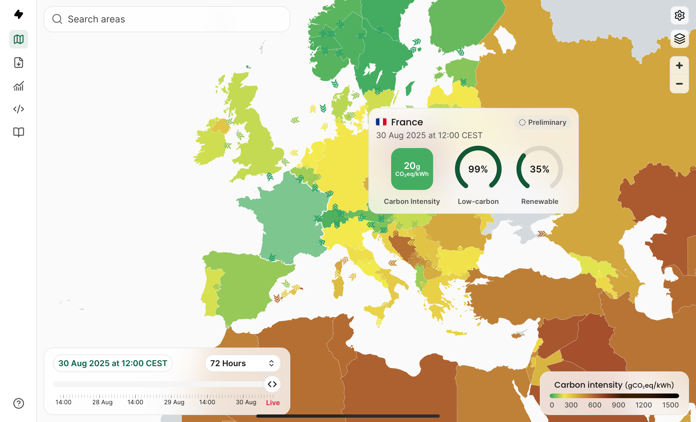

# SAÉ 12 – Exploring Home Networks & Energy Impact  

  
  
  

---

## 🇫🇷 Description (FR)  

Projet réalisé dans le cadre du **BUT Réseaux & Télécom (SAÉ 12)**.  
L’objectif était de découvrir et analyser le fonctionnement d’un **réseau domestique** et d’évaluer son **impact énergétique**.  

### 🎯 Objectifs du projet  
- Identifier les composants et la configuration d’un réseau domestique  
- Réaliser un schéma réseau complet (box, PC, routeur, serveurs DNS/DHCP)  
- Analyser le trafic réseau avec **traceroute** et **Wireshark**  
- Observer l’utilisation des IP, MAC et ports applicatifs  
- Étudier la consommation énergétique des équipements (PC, frigo, CPU stress)  
- Convertir ces consommations en **émissions de CO₂** selon différents pays  

### 🛠️ Méthodologie  
- **Q1** → Identifier son accès, IP publique/privée, paramètres DNS/DHCP, schéma réseau  
- **Q2** → Analyse de trafic (traceroute vers plusieurs sites, capture Wireshark des applis : Spotify, Chrome, etc.)  
- **Q3** → Études énergétiques :  
  - Exemple simple (frigo américain)  
  - PC portable (batterie & chargeur)  
  - Stress test CPU (consommation x10 sous charge)  
  - Conversion kWh → gCO₂ (France, Pologne, Allemagne)  

---

## 🇬🇧 Description (EN)  

Project carried out as part of the **Bachelor in Networks & Telecommunications (SAÉ 12)**.  
The goal was to explore and analyze a **home network** while also evaluating its **energy impact**.  

### 🎯 Project objectives  
- Identify components & configuration of a home network  
- Produce a complete network diagram (router, PC, DNS/DHCP servers)  
- Perform **traceroute** and **Wireshark** analysis  
- Study usage of IP, MAC addresses and ports  
- Evaluate the energy consumption of devices (PC, fridge, CPU stress test)  
- Convert consumption values into **CO₂ emissions** depending on electricity mix  

### 🛠️ Methodology  
- **Q1** → Access type, IP addressing (public/private), network parameters, diagram  
- **Q2** → Network traffic analysis (routing path, packet captures, app traffic: Spotify, Chrome, etc.)  
- **Q3** → Energy evaluation:  
  - Household fridge (reference model)  
  - Laptop battery & charger analysis  
  - CPU stress test (power x10 under load)  
  - kWh → CO₂ emissions (France, Poland, Germany)  

---

## 📂 Repository Content  
- `/docs` → diagrams, screenshots, energy calculation tables  
- `/report` → PDF reports (Rendu 1 & 2)  
- `/captures` → Wireshark files & traceroute results  
- `README.md` → summary and presentation of the project  

---

## 👨‍💻 Skills Developed  
- Network discovery & analysis (IP, DNS, MAC, traceroute, Wireshark)  
- Energy efficiency evaluation in IT systems  
- Technical reporting (FR/EN)  
- Awareness of environmental impact of digital infrastructures  

---

📸 *graphique/tableau émissions CO₂ par pays:*  

  

📊 *Exemple de tableau énergétique / Energy analysis example:*  

| Device         | Power (W) | Annual kWh | CO₂ France | CO₂ Poland |  
|----------------|-----------|------------|------------|------------|  
| Fridge (Samsung) | 39.4 W | 346 kWh | 14.1 kg | 237 kg |  
| Laptop (Dell Alienware) | 240 W (charger) | ~90 Wh battery | 1.1 kg (300 cycles) | 18.5 kg (300 cycles) |  
| CPU stress test | ~11 W/core | – | Compared to fridge ~40 W | – |  

---
